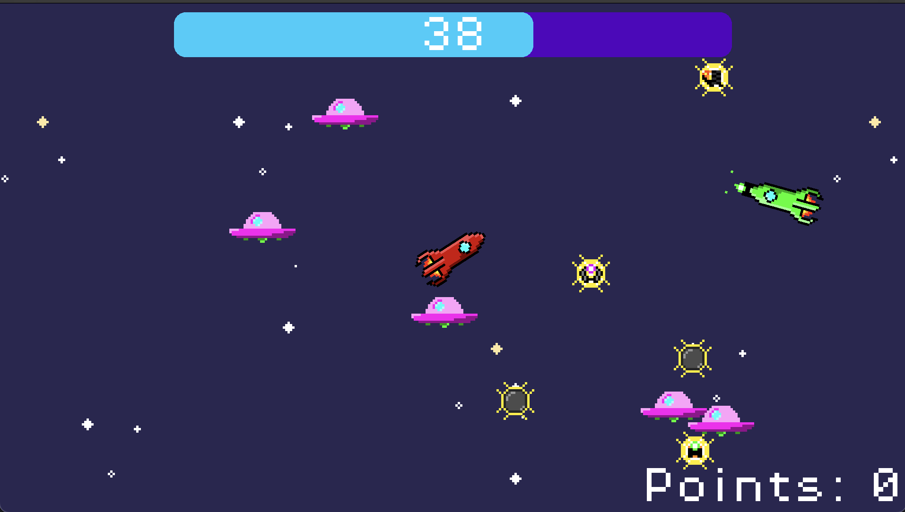

# FuzeENG

2D game developed in Godot Engine.
The Goal is to recreate the game FuzeCat original, the one online, without the ugly graphics.

For now, I put ennemies that do nothing, and the player can shoot.
I will add another player, and the ability to play with a friend.
And the goal will be to kill the other player.

## Player

- Go forward and backward with arrow keys `Up` and `Down`.
- Rotate with arrow keys `Left` and `Right`.
- The movement are smooths.

## Weapons

- Laser Projectile: Shoots 5 purple laser beams.
- Laser Ray: Shoots a continuous laser beam, twice the size of the player, for 2.5 seconds.
- Heavy Ball: Shoots a heavy ball that is affected by gravity.
- Fire: Shoots a fire, 1.5 times the size of the player, for 5 seconds.
- Flail: Shoots a flail, controlled by the player, for 5 seconds.

## Enemies

- Enemy: Do nothing.

## Time

- A game lasts 60 seconds.
- The player with the most kills wins.

## Screenshots

20 august 2024

22 august 2024

## Usage

[Link of the game](https://lacunaire.itch.io/fuzeeng)

<!--
idea:

- shield: protect the player and reflect the projectiles, for 5 seconds.
- backfire: reverse the movement of the player, for 2 seconds.
- backflash: teleport the player to his position 2 seconds ago.
- mine: can be placed by the player
- freeze: freeze the player, for 0.5 seconds.
- speed: increase the speed of the player, for 2 seconds.
- slow: decrease the speed of the player, for 1.5 seconds.
-

-->
